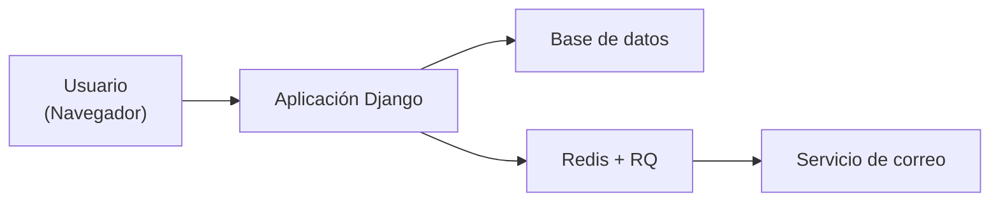
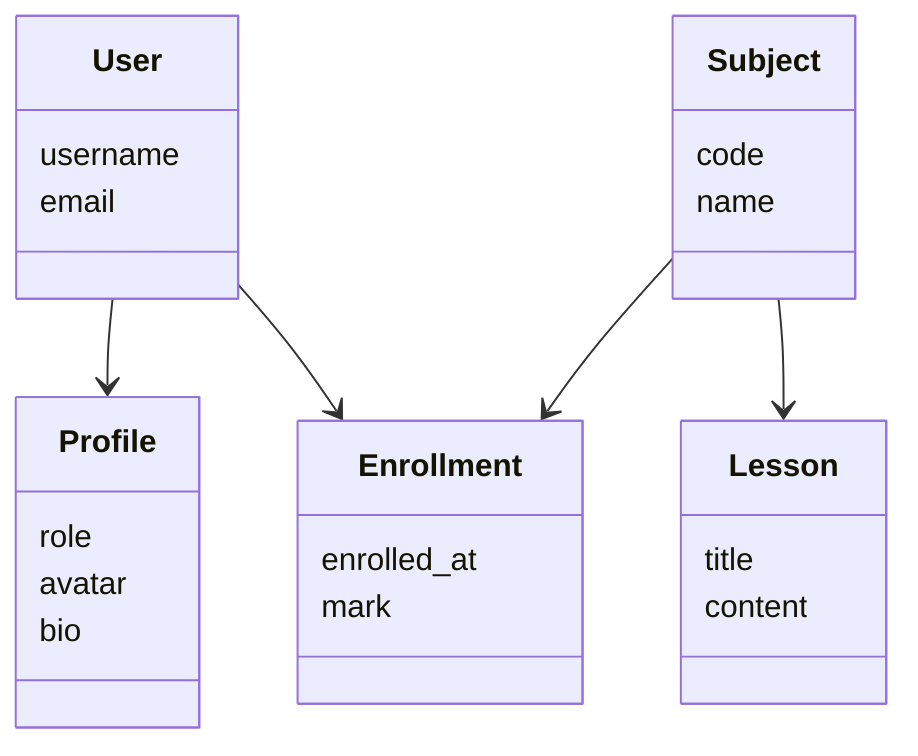
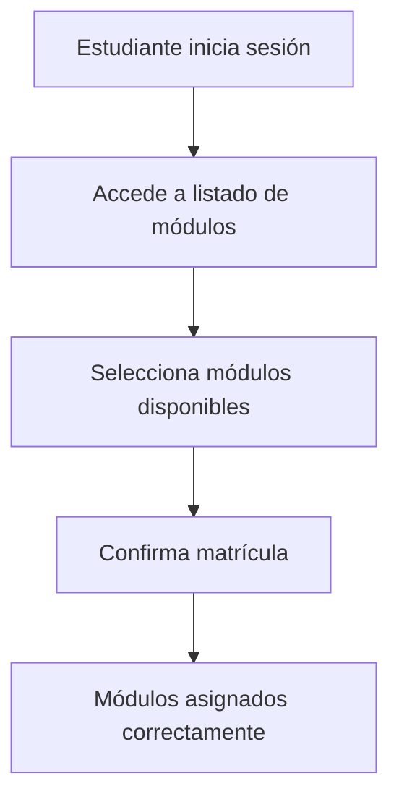
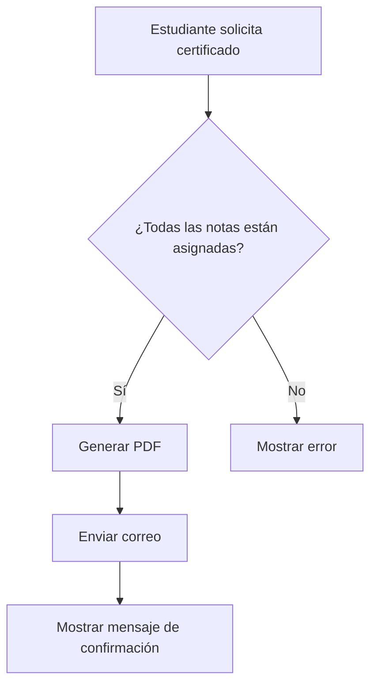

!!! success "Objetivo de este documento"
    Definir la arquitectura, los componentes principales, los diagramas estructurales y las decisiones de diseño que conforman la base técnica del sistema **Lumino**.

---

## Arquitectura del sistema

!!! success "Visión general"
    Lumino está diseñado como una aplicación web basada en **Django**, siguiendo una arquitectura clara, modular y escalable.

-    :lucide-globe: **Capa de presentación**  

     ---

     Interfaz web accesible desde el navegador, construida con plantillas Django y Bootstrap.

-    :lucide-cpu: **Capa de aplicación**  

     ---

     Lógica de negocio implementada mediante vistas, formularios y servicios de Django.

-    :lucide-database: **Capa de datos**  

     ---

     Persistencia de información mediante Django ORM y base de datos relacional.

-    :lucide-server: **Servicios auxiliares**  

     ---

     Procesamiento en segundo plano y envío de correos mediante Redis y Django-RQ.

---

### Esquema general de arquitectura

---

## Diagramas del sistema

!!! success "Modelado del dominio"
    Los siguientes diagramas representan las entidades principales y sus relaciones dentro del sistema.

### Diagrama de clases

---

### Diagrama de flujo: matrícula de un estudiante

---

### Diagrama de flujo: solicitud de certificado

---

## Decisiones de diseño

!!! success "Justificación técnica"
    A continuación se describen las decisiones clave que definen la estructura y el enfoque del sistema.

*    :lucide-code: **Uso de Django**

     ---

     Framework robusto que permite un desarrollo rápido, seguro y estructurado, con soporte integrado para autenticación y ORM.

*    :lucide-puzzle: **Arquitectura modular**

     ---

     Separación del sistema en aplicaciones (`accounts`, `subjects`, `users`, `shared`) para mejorar mantenibilidad y escalabilidad.

*    :lucide-layout: **Plantillas reutilizables**

     ---

     Uso de herencia (`base.html`) e inclusión (`header.html`) para evitar duplicación de código, además del uso de (`messages.html`) para evitar codigo duplicado.

*    :lucide-clock: **Procesos asíncronos**

     ---

     Generación de certificados y envío de correos desacoplados mediante tareas en segundo plano.

*    :lucide-image: **Gestión de imágenes**

     ---

     Uso de `sorl-thumbnail` para generar miniaturas optimizadas de avatares.

*    :lucide-file-text: **Contenido en Markdown**

     ---

     Las lecciones se almacenan y renderizan como Markdown para facilitar la creación de contenidos.

---

## Consideraciones de escalabilidad

!!! note "Preparación para el crecimiento"
    El diseño actual permite futuras ampliaciones sin modificar la base del sistema.

     * Añadir nuevos roles de usuario
     * Incorporar nuevos tipos de contenidos
     * Integrar APIs externas
     * Escalar servicios asíncronos de forma independiente

---

!!! success "Resumen"
    El diseño del sistema Lumino combina claridad estructural, modularidad y buenas prácticas de desarrollo, asegurando un proyecto mantenible, escalable y alineado con los objetivos educativos de la plataforma.
